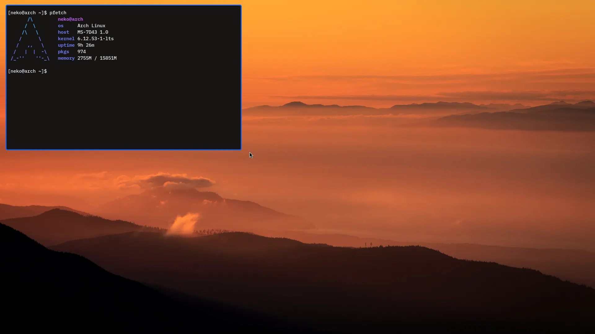

# dotfiles for my Arch system  

These are the config files for my Arch linux system.  

## Programs used:  
- Text editor: [Helix](https://helix-editor.com)
- Terminal: [foot](https://codeberg.org/dnkl/foot)
- Screenshot utilities: [grim](https://wayland.emersion.fr/grim) & [slurp](https://wayland.emersion.fr/slurp)
- Screen recording: [wf-recorder](https://github.com/ammen99/wf-recorder)
- Notification daemon: [mako](https://wayland.emersion.fr/mako)
- Menu: [fuzzel](https://codeberg.org/dnkl/fuzzel)
- Window Manager: [Niri](https://github.com/YaLTeR/niri)
- Bar: [EWW](https://github.com/elkowar/eww)  

With Niri I use the built-in screenshot commands, so no need for grim and slurp. Those are only if I want to
use another compositor like river or sway.  

  

The bar is not ready yet, but *soon* it will be...  

## TODO list  
- [x] Update my scripts
- [ ] Add a description for my dev setup
- [ ] Finish my EWW config
- [ ] Remove or mark unused configs
- [ ] Update the screenshot
- [ ] Write an installation script  
