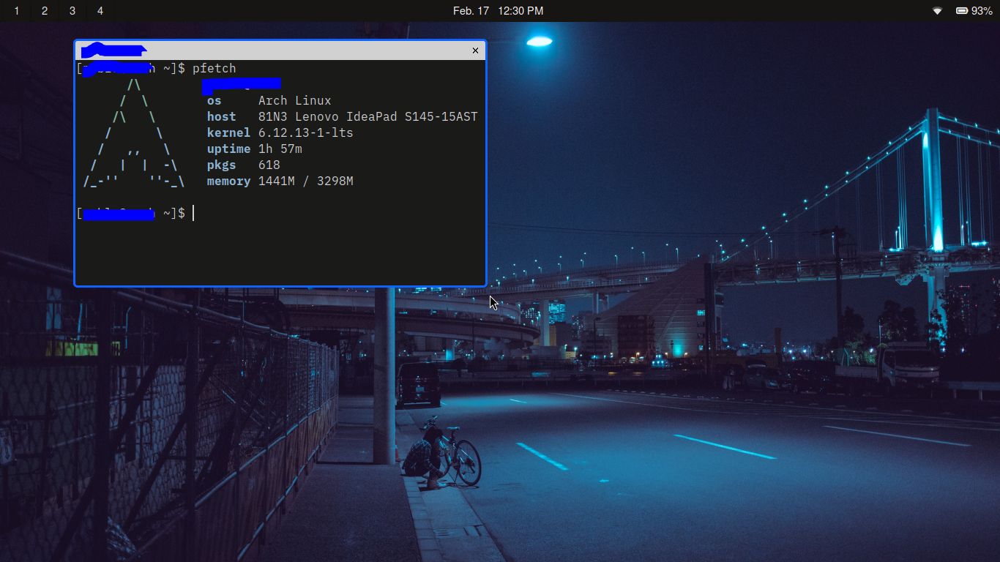

# dotfiles for my Arch system  

This are my config files or "dotfiles" for my laptop running Arch linux.

## Programs used:  
- Text editor: [Helix](https://helix-editor.com)
- Terminal: [foot](https://codeberg.org/dnkl/foot)
- Screenshot utilities: [grim](https://wayland.emersion.fr/grim) & [slurp](https://wayland.emersion.fr/slurp)
- Notification daemon: [mako](https://wayland.emersion.fr/mako)
- Menu: [fuzzel](https://codeberg.org/dnkl/fuzzel)
- Window Manager: [Niri](https://github.com/YaLTeR/niri)
- Bar: [EWW](https://github.com/elkowar/eww)  

~~For neovim you need to install Plug~~
For the text editor I use Helix because it just works without much configuration. Here is
my entire `config.toml`:  

```
theme = "carbonfox"
```
  
There was a time when I used DWL daily, but looking at the current state of Wayland, I would rather use something
that I can easily update without having to maintain my own repo and patching every time there is a new release.
After that I used River for like a month before discovering Niri.  

  

The bar you see was created with EWW, but it is still *work in progress*. EWW is really a framework to build
widgets, but it can be used to create a bar and it also comes with a systray. Regardless, I would advice
against using it because you will be forced to write everything from scratch using a custom *lisp-like*
language called yuck.

## TODO list  
- [x] Update my scripts
- [x] Add a description for my dev setup
- [ ] Finish my EWW config
- [ ] Remove or mark unused configs
- [ ] Write an installation script  
